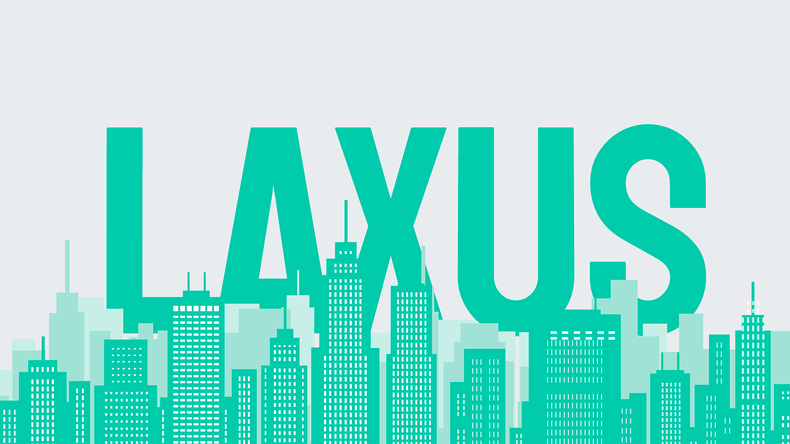
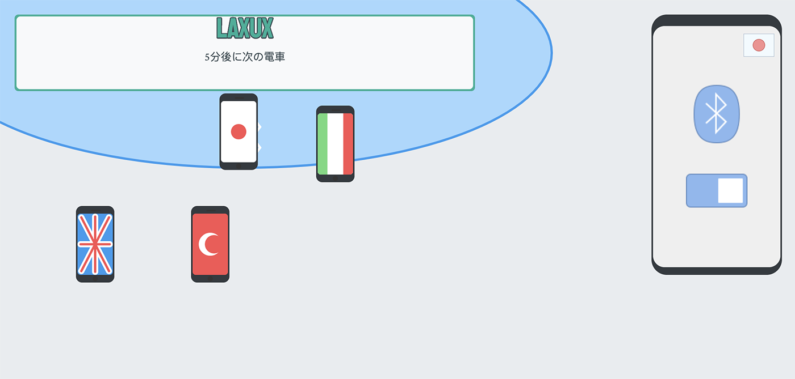

[![GithubLastCommit][last-commit-shield]][last-commit-url]


<!-- PROJECT LOGO -->
<br />
<p align="center">
  <a href="https://github.com/bmangeat/laxux-interactive-billboard">
    
  </a>

<h3 align="center">LAXUS</h3>
<p style="font-style: italic" align="center">Language Adaptation X User Experience</p>

  <p align="center">
    <a href="https://bmangeat.github.io/laxux-interactive-billboard/">View Demo</a>
    ·
    <a href="https://github.com/bmangeat/laxux-interactive-billboard/issues">Report Bug</a>
    ·
    <a href="https://github.com/bmangeat/laxux-interactive-billboard/issues">Request Feature</a>
  </p>


<!-- TABLE OF CONTENTS -->
<details open="open">
  <summary>Table of Contents</summary>
  <ol>
    <li>
      <a href="#about-the-project">About The Project</a>
      <ul>
        <li><a href="#built-with">Built With</a></li>
      </ul>
    </li>
    <li>
      <a href="#getting-started">Getting Started</a>
      <ul>
        <li><a href="#prerequisites">Prerequisites</a></li>
        <li><a href="#installation">Installation</a></li>
      </ul>
    </li>
    <li><a href="#contributing">Contributing</a></li>
    <li><a href="#license">License</a></li>
    <li><a href="#contact">Contact</a></li>
  </ol>
</details>


<!-- ABOUT THE PROJECT -->

## About The Project

<p align="center">
    
</p>

Around the dynamic-content billboard, a floor area is drawn to indicate an 
interactive area and recommends Bluetooth’s activation. When the user enters 
the range, the displays adapt. We can know the distance between the two 
devices and the language of the phone’s OS while receiving the signal.
 The closest user sees the display adapting to his preferences. 
Beyond the translation, the interactive work adjusts the typefaces according 
to the language, allowing to design the service according to the user. 
We also thought that the background could alter, and display some isometric 
design depending on the language found. For example, a french tourist 
will see an isometric Eiffel Tower on the background. 
Therefore, the user will be drawn to our display.
 We could extend our project to other public spaces.
 For example, ads could be translated near bus station as well as bus informations,
 in the same way that some companies have developed real-time text translation.
### Built With

Major frameworks I used in this project.

* [P5js](https://p5js.org/)

<!-- GETTING STARTED -->

## Getting Started

### Installation

1. Clone the repo
   ```sh
   git clone https://github.com/bmangeat/template-backoffice.git
   ```

<!-- CONTRIBUTING -->

## Contributing

Contributions are what make the open source community such an amazing place to be learn, inspire, and create. Any
contributions you make are **greatly appreciated**.

1. Fork the Project
2. Create your Feature Branch (`git checkout -b feature/AmazingFeature`)
3. Commit your Changes (`git commit -m 'Add some AmazingFeature'`)
4. Push to the Branch (`git push origin feature/AmazingFeature`)
5. Open a Pull Request

<!-- LICENSE -->

## License

Distributed under the ISC License.


<!-- CONTACT -->

## Contact

Brice MANGEAT - [@BriceMangeat](https://twitter.com/BriceMangeat) - brice.mangeat@gmail.com

Margaux VAILLANT - margauxvllt@gmail.com

Project Link: [https://bmangeat.github.io/laxux-interactive-billboard/](https://bmangeat.github.io/laxux-interactive-billboard/)


<!-- MARKDOWN LINKS & IMAGES -->
<!-- https://www.markdownguide.org/basic-syntax/#reference-style-links -->

[linkedin-shield]: https://img.shields.io/badge/-LinkedIn-black.svg?style=for-the-badge&logo=linkedin&colorB=555

[linkedin-url]: https://www.linkedin.com/in/brice-mangeat-web-student/

[twitter-shield]: https://img.shields.io/twitter/follow/BriceMangeat?color=blue&label=Twitter&logo=Twitter&logoColor=white&style=for-the-badge

[twitter-url]: https://twitter.com/BriceMangeat

[github-shield]: https://img.shields.io/github/followers/bmangeat?color=lightgrey&label=Github&logo=github&style=for-the-badge

[github-url]: https://github.com/bmangeat

[last-commit-shield]: https://img.shields.io/github/last-commit/bmangeat/laxux-interactive-billboard?color=yellow&style=for-the-badge

[last-commit-url]: https://github.com/bmangeat/laxux-interactive-billboard/commits
